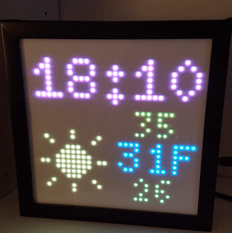

Raspberry Pi LED Matrix
=======================

Displays programmatic scenes such as a clock and weather notification board, or Conway's Game of Life.
A tiny clock and weather notification board for the morning.
Uses [hzeller's rpi-rgb-led-matrix code](https://github.com/hzeller/rpi-rgb-led-matrix) for driving the board.

## Installation
Required packages:
```pip install Pillow requests```

On a brand new Pi running Raspbian Lite:
```
sudo apt-get install python3-pip libjpeg-dev
pip install Pillow requests
cd matrix
make build-python PYTHON=$(which python3)
sudo make install-python PYTHON=$(which python3)
```

## Setup
Edit the file `settings.ini` with your [OpenWeatherMap API key](https://openweathermap.org/api) and the city code for your location.
```
[weather]
api_key = YOUR_API_KEY
city_id = YOUR_CITY_ID

[time]
start_hr = 7
start_min = 30
end_hr = 22
end_min = 0
```

## Usage
```sudo ./weatherclock.py```

## How beautiful
Weather effects!




## How?
Like this:


